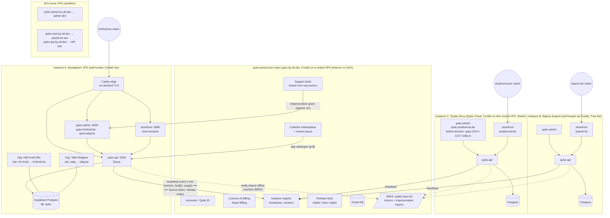
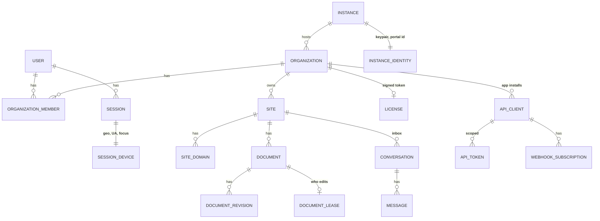
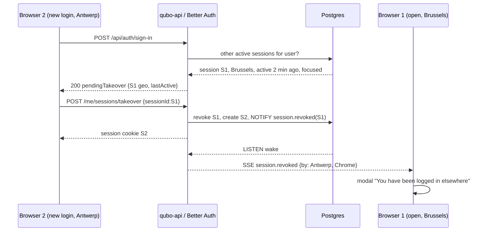
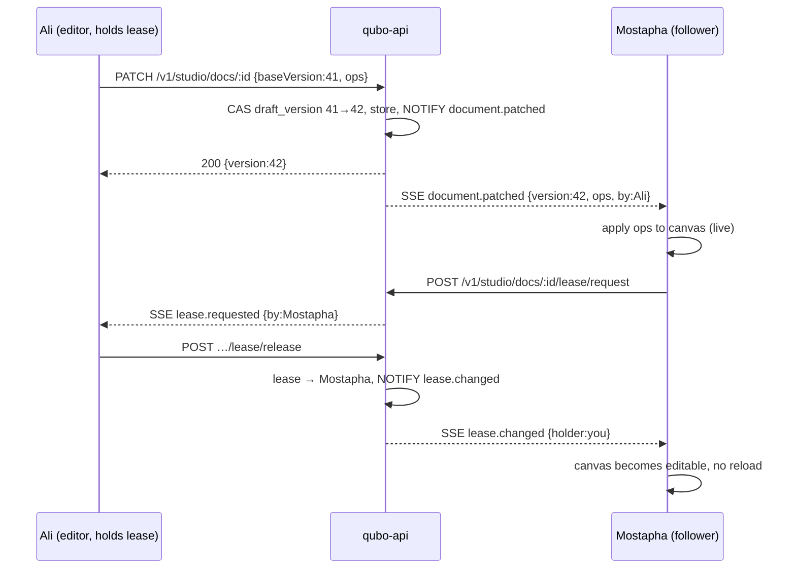

# Qubo platform plan (handoff for Opus)

> Status of the codebase this plan starts from: `aliaddas/qubo-stack` @ `c0d635f`.
> Admin (`apps/qubo-admin`) has products, product editor, categories, Studio (Puck) editor
> with drafts/publish/revisions and a theme editor. `packages/api` (Elysia) owns tenancy and
> exposes `/studio/*` + `/render/*`. `apps/hm-froid` is a single-tenant storefront that still
> reads the DB directly in places. Version is really `0.0.2` (root `package.json` says 1.0.0, fix).
>
> Everything below is a plan, not code. Phases are ordered so each one ships something usable.

---

## 0. One-paragraph strategy

Qubo is a self-hosted, multi-site business platform (a CMS and site builder first; commerce is one
capability). One **instance** (a repo clone on a VPS) runs **one admin + one generic storefront +
one API** and can serve many organisations and sites. A separate, privately-hosted **Portal**
(its own repo, `qubo-portal`) is the fleet brain: accounts, licences, instance registry, releases,
impersonation, marketplace, and Ali's support desk. Instances **never depend on the Portal being
up**: licences are signed offline tokens with a grace period, and all Portal traffic is outbound
from the instance (heartbeat). The platform gets one **realtime bus** (Postgres `LISTEN/NOTIFY`
→ SSE) that powers live collaboration, presence, session takeover, inbox badges and
publish→storefront revalidation. Monetisation gates *scale* (sites, instances, seats, AI, apps),
never *core tooling*.

---

## 1. Target architecture

### 1.1 Fleet view, Portal + three imaginary customers



Key properties:

- **Outbound-only** from instances. No inbound ports for the Portal, no NAT problems.
- **Portal down ⇒ nothing breaks.** Licence tokens are valid for 30 days and refreshed on every
  heartbeat; the instance shows a soft banner after 7 days without contact, never blocks.
- **Instance A is Ali's "god's eye" case**: two organisations in one instance, one dashboard.
- **Instance C (cloud)** is the same image as A/B; "cloud" is just Ali running the instance.

### 1.2 Inside one instance

```mermaid
flowchart LR
  subgraph Edge["Caddy (on-demand TLS, ask endpoint), routes by host"]
    H1[qubo.hmfroid.be<br/>qubo.tailg.be]
    H2[hmfroid.be / www]
    H3[tailg.be]
    H4[qubo-web.by-ali.dev dev preview]
  end
  H1 --> ADM[qubo-admin]
  H2 & H3 & H4 --> SF[storefront<br/>host → site_domain → site]
  SF -. "qubo_staff hint cookie (parent domain)<br/>⇒ Edit pen → qubo.&lt;domain&gt;" .-> ADM
  ADM -- server actions --> STUDIO[(@qubo/studio services)]
  ADM -- SSE /events --> API
  SF -- "@qubo/storefront client<br/>/v1/render/*" --> API[qubo-api]
  API --> STUDIO --> DB[(Postgres)]
  DB -- "NOTIFY qubo_events" --> API
  API -- "SSE fan-out" --> ADM & SF
  API -- "revalidateTag(site:x, doc:y)" --> SF
  APPS[Cubicles<br/>3rd-party apps] -- "/v1/* scoped tokens<br/>webhooks out" --> API
```

### 1.3 Entity model (additions in **bold**)



---

## 2. Repositories and packages

### 2.1 `qubo-stack` (this repo), the instance

```
apps/
  qubo-admin/        control plane (exists)
  storefront/        NEW generic host-resolved storefront (replaces apps/hm-froid)
packages/
  api/               Elysia; add /v1 prefix, /events SSE, /v1/apps, /v1/domains, /portal/*
  db/                schema (exists)
  studio/            Studio services (exists) + leases + patch broadcast
  blocks/ stylekit/  (exist)
  storefront/        typed API client (exists) → pin /v1
  shared/            (exists)
  realtime/          NEW pg LISTEN/NOTIFY publisher + SSE subscriber + typed event catalogue
  entitlements/      NEW licence token verify + feature/limit checks (used by admin UI and API)
  protocol/          NEW zod schemas for Portal↔Instance (Heartbeat, LicenseToken, ImpersonationGrant,
                     ReleaseFeed, AppManifest). Source of truth; published for the Portal.
  inbox/             NEW conversation engine (channels, assignment, AI triage hooks)
  apps-sdk/          NEW Cubicles: manifest, scopes, token issuance, webhook signing, App Bridge
  geo/               NEW IP → city lookup (mmdb), UA parsing
cli/
  qubo/              NEW `qubo update|doctor|register|backup` (Node, no deps beyond repo)
```

Shared packages are **published to GitHub Packages** (`@qubo/*`) from CI on each tag, so the Portal
can consume them without a monorepo link. `@qubo/protocol` is versioned independently
(`protocolVersion` travels in every heartbeat).

### 2.2 `qubo-portal`, new private repo

Next.js 16 + Drizzle + Better Auth + Stripe Billing, its own Supabase project at OVH. Consumes
`@qubo/protocol`, `@qubo/shared`, `@qubo/inbox`, `@qubo/entitlements`. Holds the private signing
keys (Ed25519) for licences and impersonation; publishes JWKS at `/.well-known/jwks.json`.

Portal modules (MVP → later): Accounts & orgs · Instances (registry, heartbeat timeline,
version/health) · Licences & plans (Stripe) · Impersonate ("Open as owner") · Releases (channels,
notes, deprecation flags) · Support desk (`@qubo/inbox`) · Marketplace + review queue (the
"valve") · Cloud hosting provisioner (later: Coolify API on Ali's rented VPS).

### 2.3 Domains and hostnames (decided)

| Purpose | Host | Where |
| --- | --- | --- |
| Marketing (static/ISR, reads plans) | `qubo.by-ali.dev` | rented VPS (Coolify), repo qubo-portal `apps/marketing` |
| Portal (accounts, orgs, instances, licences) | `portal.qubo.by-ali.dev` | same, `apps/portal` |
| Portal API (auth, fleet protocol, JWKS) | `api.portal.qubo.by-ali.dev` (`/.well-known/jwks.json`, `/v1/*`) | same, `packages/api` |
| Portal Supabase Studio (auth only, never raw Postgres) | `db.portal.qubo.by-ali.dev` | same |
| Dev box, whichever project runs `qd up` | `dev.by-ali.dev` (slot 1), `<site>.dev.by-ali.dev` / `www.dev.by-ali.dev` (slot 2), `api.dev.by-ali.dev` (slot 3), `db.dev.by-ali.dev` (Studio, basicAuth) | home VPS, ports `<digit>0<slot>0` |
| Customer admin / storefronts | `qubo.<their domain>` / their domain | customer VPS |
| Temporary admin before a domain is connected (install day only) | `qubo.<ip-with-dashes>.sslip.io` | customer VPS |

`by-ali.dev` stays personal. Nothing in code hardcodes a domain: `PORTAL_URL`,
`PLATFORM_BASE_DOMAIN` (storefront preview subdomains), `ADMIN_SUBDOMAIN` (default `qubo`).

### 2.4 Admin access model (settled: `qubo.<yoursite>`)

- **The panel lives at `qubo.<site's primary domain>`**, e.g. `qubo.hmfroid.be`. The phrase for
  merchants is "put *qubo* in front of your website address". Caddy routes `qubo.*` hosts to
  `qubo-admin` and everything else to the storefront. Every site of an instance gets its own
  `qubo.` host on its **primary domain only** (`qubo.hmfroid.com` 301s to `qubo.hmfroid.be` when
  `.be` is primary). The admin is **never** served anywhere else; all of them open the **same** admin (site switcher, cross-org Panel view) and
  only pick the *default* site from the host. Prefix configurable via `ADMIN_SUBDOMAIN`.
- **`/admin` is only a shortcut:** the storefront 302s `example.be/admin*` → `qubo.example.be`.
  `robots.txt` on `qubo.*` disallows everything; admin responses send `X-Robots-Tag: noindex`.
- **One identity, roles decide.** Customers and staff share Better Auth users; a customer has no
  `organization_member` row and never sees anything privileged. Customer account/orders stay at
  `/account` **on the main site** (Kyf Moves lesson: members must never need a second hostname).
- **Cookies and the Edit pen (secure by default):**
  - The **admin session cookie is host-only** on `qubo.example.be` (`__Host-` prefix, HttpOnly,
    Secure, SameSite=Lax). It is never scoped to the parent domain, because merchants often have
    other subdomains hosted by third parties (`blog.example.be` on Wix) that would receive it.
  - The admin additionally sets a **non-secret hint cookie** `qubo_staff=<siteIds>` on the parent
    domain (`Domain=example.be`, registrable domain via `tldts` so `.co.uk` works). It grants
    nothing; it only tells the storefront to render the floating **Edit pen** (bottom-right,
    dismissible per session) and a slim admin bar (Edit page · Edit theme · Dashboard). A spoofed
    hint just shows a pen that leads to a sign-in page.
  - The pen links to `qubo.example.be/<slug>/studio?doc=<current document id>`. Before showing
    it, the storefront may confirm with `GET qubo.example.be/api/me` (CORS: exact origin
    allowlist from verified `site_domain`, `credentials: include`).
  - **Staff signing in on the main site** (the storefront login form):
    - *Phase 1 (cheap placeholder):* if the account has membership on this site, the account page
      shows an **"Open Qubo"** button linking to `qubo.example.be/sign-in?email=<prefilled>`.
      One extra password prompt, zero new security surface.
    - *Phase 2 (real):* the button uses a **one-time handoff token** (signed, 60 s, single-use,
      bound to user + target host, stored hashed in `auth_handoff`) →
      `qubo.example.be/auth/handoff?t=…` creates the admin session without a second login. Same
      mechanism later powers in-place editing on the live site.
- **Mobile.** The admin ships a web-app manifest (`name: "Qubo · HM Froid"`, standalone, cube
  icon) so "Add to Home Screen" gives a native-feeling panel; push notifications later via the
  inbox. App-store wrappers can come later; the PWA covers the "Qubo app" story.
- **Fallback (install day only).** Before any domain is verified, the admin is reachable at
  `qubo.<ip-with-dashes>.sslip.io` (e.g. `qubo.51-77-12-3.sslip.io`). sslip.io is a free public
  DNS that resolves any name to the IP written in it, so Caddy can get a real HTTPS certificate
  and secure cookies work. It's a temporary URL, so it stays plain: which org/instance owns which
  IP is mapped internally (Portal `instance` row: org, server IP, fallback host), not in the name.
  The UI shows the server IP as its **own field** ("Server IP: 51.77.12.3 · Copy") in the
  installer output, Settings → Domains and the DNS setup modal, since the A record needs it.
  The installer prints this URL and the IP; it works without the Portal. Allowed by the Caddy
  `ask` endpoint only while the instance has no verified domain
  (`FALLBACK_BASE_DOMAIN=sslip.io`), then it redirects to `qubo.<primary domain>`.
- Better Auth: dynamic `trustedOrigins` built from verified `site_domain` rows (both the apex and
  `qubo.` variants) plus `PLATFORM_BASE_DOMAIN`; refreshed on `site.domain.changed`.

---

## 3. Phase 1, Generic storefront and admin→storefront sync

**Goal:** `apps/storefront` renders any site of the instance from the published Puck documents,
by hostname, with per-site SEO, and updates the moment someone publishes. `apps/hm-froid` is
deleted once parity is reached.

### 3.0 Scope and first milestone
- **New app, not a rename.** `apps/storefront` is a fresh, generic, host-resolved Next.js app.
  `apps/hm-froid` is a *donor*: its cart/checkout/account/blog/Stripe code is ported over (§3.2),
  then the folder is deleted. Nothing in `apps/storefront` may hardcode HM Froid.
- **Milestone 1 (the "ecstatic" demo):** `qubo-web.by-ali.dev` renders HM Froid's existing
  published Puck documents (11 `template` + 2 `section_group` rows in `document`, all with
  `published_data`): header/footer section groups, home, collection, product, page templates,
  with HM Froid's theme. Read-only first (no cart), commerce parity follows.
- **TailG:** its Puck docs exist (same 11 + 2) and must *render without errors* as a host-resolution
  smoke test, but content/design is out of scope (Fable revamp later). No TailG-specific work.

### 3.1 Host resolution

- `middleware.ts` reads `Host`, strips port, lowercases, rewrites to `/_sites/<siteId>/<path>`.
  Resolution order: exact `site_domain.hostname` (verified) → `<slug>.<PLATFORM_BASE_DOMAIN>` →
  `STOREFRONT_DEFAULT_SITE` env (single-site installs) → 404 page "No site on this host".
- `qubo.*` hosts never reach the storefront (Caddy), but middleware returns 404 for them as a
  safety net. `/admin*` on a storefront host 302s to `qubo.<host>`.
- Resolution is cached in-process (LRU, 60 s) and invalidated via the `site.domain.changed` event.
- Non-primary verified domains 301 → primary (preserve path + query).
- Preview: `?preview=<signed token>` (exists in `/render/*`) bypasses ISR and renders the draft.

### 3.1b Site links ("View site", "Preview", sitemap, emails), one helper, no hand-built URLs
- Today `apps/qubo-admin/app/(app)/[site]/page.tsx` builds `https://${site.domain}` and only shows
  the button when a domain exists. In dev that opens the **live** hmfroid.be. Replace every such
  link with `siteUrl(site, path?, { preview? })` in `@qubo/core` (server) + `useSiteUrl()` (client).
- Resolution order: dev override (`QUBO_DEV_SITE_HOSTS`, e.g. `hm-froid → qubo-web.by-ali.dev`,
  or `localhost:4010` in local mode) → primary **verified** `site_domain` → `<slug>.<PLATFORM_BASE_DOMAIN>`
  → install fallback `qubo.<ip>.sslip.io`-style storefront host → button disabled with tooltip
  "Connect a domain" (links to the Domains page). Never an unverified domain.
- Variants: "View site" = published URL of the site (or of the current document/product/category
  path); "Preview" in Studio = same host + signed `?preview=` token (draft, `noindex`, expires).
- The admin host is resolved the same way via `adminUrl(site)` (production `qubo.<domain>`,
  dev `QUBO_ADMIN_HOSTS`), used by the storefront Edit pen and emails.
- Lint guard: a check that fails on `https://${...domain` template literals outside the helper.
- Test matrix: dev remote, dev local, verified domain, unverified domain, no domain, multi-domain
  (non-primary), preview token.

### 3.2 Data path

Storefront → `@qubo/storefront` client → `qubo-api /v1/render/*` (localhost on the same box; a
hop of ~1 ms). No direct DB imports in `apps/storefront` (HANDOFF decision 8). Port from
`hm-froid`: cart, checkout (Stripe), account, blog, maintenance, sitemap/robots, Stripe webhook , 
each gated by `site.capabilities`. Routes that a site lacks the capability for return 404.

### 3.3 Rendering and caching

- RSC renders `@qubo/blocks` render config with `publishedData` + locale overlay + `theme.css`.
- `unstable_cache`/`"use cache"` with tags: `site:<id>`, `doc:<id>`, `theme:<id>`, `catalog:<siteId>`.
- Admin publish (in `@qubo/studio.publish`) emits `document.published` → API handler calls the
  storefront's `POST /api/revalidate` (shared secret `REVALIDATE_SECRET`) with the tags. Product
  saves emit `catalog.changed` → `catalog:<siteId>`. Result: publish is live in < 1 s, no redeploy.

### 3.4 SEO per host (already decided; make concrete)

`generateMetadata` from `site_settings` + document SEO fields; canonical to primary domain;
`sitemap.ts` and `robots.ts` resolve the host like pages do; `hreflang` from `site_locale`;
Open Graph image route `/og/<docId>` (ImageResponse); JSON-LD `Product`/`Organization`/
`BreadcrumbList` from blocks that declare `seo()` in their schema; `noindex` on preview and
non-primary hosts.

### 3.5 Deliverables

- `apps/storefront` with the routes above; `apps/hm-froid` removed; compose + Caddyfile updated;
  `docs/storefront.md` (host resolution, caching, env).
- Admin served on `qubo.<domain>` with host → default-site redirect; Caddy host routing;
  `qubo_staff` hint cookie, storefront Edit pen + admin bar, `/api/me` with CORS allowlist,
  storefront `/admin` redirect, handoff tokens, web-app manifest.
- `/v1/render/*` gets `categories`, `products by category`, `search`, `navigation`, `redirects`.
- Parity check list with the current hmfroid.be (home, category page, product page, cart,
  checkout, account, blog, 404, maintenance).

---

## 4. Phase 2, Realtime bus, presence, sessions with geolocation

### 4.1 `@qubo/realtime`

- Publisher: `publish(event)` = insert into `platform_event` (durable, 7-day retention, lets late
  joiners catch up by `id > lastSeen`) + `NOTIFY qubo_events, '<eventId>'` (payload is just the id;
  NOTIFY payloads are capped at 8 kB).
- Subscriber: API process holds one `LISTEN` connection, loads the event row, fans out to SSE
  clients filtered by `siteId`/`orgId`/`userId`. Endpoint `GET /events?since=<id>` with
  `Last-Event-ID` resume. Heartbeat comment every 25 s (proxies). Client falls back to polling
  `/events/poll` every 30 s if SSE fails twice.
- Typed catalogue (zod): `document.published|patched|lease.*`, `entity.updated {table,id,by}`,
  `presence.*`, `session.revoked`, `conversation.*`, `site.domain.changed`, `license.changed`,
  `release.available`.
- Why not Redis/Supabase Realtime: single-VPS instances, zero extra service, Postgres is already
  the only stateful dependency; Redis becomes an opt-in adapter if an instance scales out.

### 4.2 Presence

- Client hook `usePresence({ route, documentId?, blockId?, fieldPath? })` posts `/me/presence`
  (debounced 2 s, heartbeat 30 s visible / 120 s hidden, `sendBeacon` on `pagehide`).
- Server keeps presence in memory per API process, TTL 90 s, broadcasts diffs.
- UI: avatar stack in the top bar (who is in this site), avatar on the row in index tables
  ("Mostapha is editing"), avatar beside a field in forms, avatars on blocks in the Studio.

### 4.3 Sessions: devices, geolocation, takeover

Schema `session_device` (1:1 with Better Auth `session`): `device_label`, `browser`, `os`, `ip`,
`city`, `region`, `country`, `country_code`, `lat`, `lng`, `last_active_at`, `last_focused_at`,
`is_focused`, `revoked_reason`, `took_over_session_id`.

- Geo: `@qubo/geo` with a local **DB-IP Lite City** database file (free, no account, CC-BY:
  add "IP geolocation by DB-IP" in Settings → Security). Monthly `scripts/geo-update.mjs`
  downloads it; the lookup runs on the instance, no visitor IP leaves the server. MaxMind
  GeoLite2 is a drop-in alternative behind the same interface. No runtime calls to
  third parties. Private/loopback IPs → "this network". IP is taken from `X-Forwarded-For` only
  when the peer is in `TRUSTED_PROXIES` (Caddy).
- Login flow (Better Auth `after` sign-in hook): if another session of this user has
  `last_active_at` within 30 min → respond `{ pendingTakeover: { city, region, country,
  deviceLabel, lastActiveAt, isFocused } }`. The sign-in page shows:

  > Your account currently has another session open on **Chrome · Windows** from
  > **Brussels (Saint-Gilles), Belgium**. Last active **2 min ago**, tab in focus.
  > [Sign out that device and continue] [Cancel]

  Takeover revokes the other session, records `took_over_session_id`, publishes
  `session.revoked {sessionId, by: {city, deviceLabel}}` → the other tab's SSE listener shows a
  blocking modal **"You have been logged in elsewhere"** with the detail line "Chrome on Windows
  · Antwerp, Belgium · just now" and a "Sign in again" button. Policy: **always ask, never
  auto-kick**, a session is only ended when the new sign-in explicitly confirms the takeover. If the other tab is offline it finds out on the next
  request (401 → same modal, reason fetched from `session_device.revoked_reason`).
- Settings → Security → Sessions: list of devices with flag, city, last active, "current",
  revoke buttons; audit log of takeovers.
- Reliability rules: server timestamps only; idempotent takeover (token bound to the revoked
  session id); never trust client `isFocused` for security decisions, only for the message.



---

## 5. Phase 3, Live collaboration (Studio + forms)

**Principle:** nobody ever has to refresh, and nobody ever loses work. Two mechanisms, chosen
per surface.

### 5.1 Studio documents: lease + follow + live patches

- `document_lease (document_id PK, session_id, user_id, acquired_at, renewed_at, expires_at)`.
  TTL 30 s, renewed every 10 s by the holder. Exactly one **editor**; everyone else opens the same
  document in **follow mode**: the canvas is live but read-only, with the editor's cursor/selection
  shown (block-level highlight, not pixel cursors).
- Editing sends **JSON Patch (RFC 6902)** ops against the Puck tree with `baseVersion`; the server
  applies (CAS on `draft_version`), stores, and broadcasts `document.patched {version, ops, by}`.
  Followers apply ops locally; if their version lags by > 1 they refetch the draft. Autosave as it
  exists today becomes "patch flush" (same `useDocumentSync`).
- **Request control**: follower clicks "Request edit" → editor sees a toast "Mostapha wants to
  edit" (Give control / Keep); auto-handoff when the holder has been idle 60 s or the lease
  expires (tab closed/crash). Handoff is atomic (`UPDATE … WHERE expires_at < now() OR session_id = $old`).
- Conflict can still occur when the lease expired while the old editor was offline with unsent
  patches. Then: **block-level three-way merge** (blocks have stable ids): non-overlapping block
  edits merge automatically; overlapping ones open the existing `ConflictDialog` *per block*
  (keep mine / take theirs / keep both as a copy). Nothing is thrown away silently.
- Theme drafts use the same lease mechanism (one lease per theme document).
- **Spectate.** Clicking a presence avatar → "Watch Mostapha". The viewer's Studio follows that
  user's route (which document/template), selection (block highlighted, inspector shows the
  field being typed in) and live patches, with a "Watching Mostapha · Stop" pill. Works in the
  admin too (follows route changes, highlights the form field in focus, read-only). Built from
  the same presence + patch events, no screen recording. Later: "Replay last 30 min" from the
  stored patch log.
- **Decision:** watch-only (lease + follow + spectate) is the Phase 3 scope. Simultaneous editing
  (Yjs CRDT) is deferred.
- **Later option (Phase 9):** replace lease with Yjs CRDT for true simultaneous editing. The patch
  bus and ids make that a swap, not a rewrite. Not needed to beat Shopify's experience.

### 5.2 Forms (products, categories, settings, customers)

- Every editable table gets `version integer not null default 1` (bump on write). `SettingsForm`
  posts `_version`. Actions compare; on mismatch return `{ conflict: { theirs, mine, changedBy,
  fields[] } }`. `SettingsForm` renders a **field-level merge sheet**: for each differing field,
  "Keep mine" / "Use theirs", then re-submits with the new version. Fields that only one side
  changed resolve automatically.
- If a form is **not dirty** and `entity.updated` arrives for its record → `router.refresh()` +
  quiet toast "Updated by Mostapha just now". If it **is** dirty → non-blocking banner "Mostapha
  saved changes to this product · Review" that opens the same merge sheet.
- Index pages subscribe to `entity.updated` for their table → refresh rows in place.



---

## 6. Phase 4, Custom domains and staging

- Admin → Online store → **Domains**: list (hostname, status chips: *Waiting for DNS* →
  *Verified* → *Certificate issued*, *Primary*), add dialog, set primary, remove.
- **Setup modal** after adding `example.be`:
  1. Pick provider (OVH, Cloudflare, Combell, one.com, Other) → tailored screenshots/wording.
  2. Records: apex `A → <INSTANCE_PUBLIC_IP>` (or ALIAS/ANAME if supported), `www CNAME → example.be`,
     verification `TXT _qubo-verify.example.be = qubo-verify=<token>`.
  3. "Check now" button; auto-check every 60 s (server `dns.resolve4/resolveTxt` against 1.1.1.1 and
     8.8.8.8; verified when both agree). Explains propagation (up to 24 h; usually minutes).
     The Caddy `ask` endpoint approves `example.be`, `www.example.be` and `qubo.example.be` once the
     domain's TXT is verified.
  4. On verification: `verified_at` set, `site.domain.changed` emitted, resolver cache invalidated,
     e-mail + in-app notification "example.be is live", and the panel offers to switch its own
     bookmark: "Your panel is now at qubo.example.be".
  Modal quality bar (this is the hardest part of the whole product for non-technical users):
  - **Exactly three routing records + one proof**, always in this order and explained in one line
    each: `A @ → <IP>` ("your website"), `CNAME www → example.be` ("with www"), `CNAME qubo →
    example.be` ("your Qubo panel"), `TXT _qubo-verify → qubo-verify=<token>` ("proves it's
    yours"). No ALIAS/ANAME vocabulary; if a provider can't CNAME, show the `A` alternative.
    The modal checks each independently, so the site goes live as soon as `@` resolves even if
    `qubo` is still pending (the panel stays reachable on `qubo.<ip>.sslip.io` meanwhile).
  - A "Do it for me" path for Cloudflare/OVH/Combell later via their DNS APIs or Domain Connect
    (one OAuth click creates all records), leave the provider adapter interface ready now.
  - Each record is a copyable row (Type · Name · Value · TTL) with a "copied ✓" state; values shown
    exactly as the provider's form expects (`@` vs blank name, trailing dot or not, per provider).
  - Provider guides with screenshots for OVH, Combell, Cloudflare, one.com, GoDaddy, Namecheap,
    TransIP, Hostinger; "I don't know my provider" → we look it up from the domain's NS records and
    preselect it.
  - **"Send instructions to my web guy"**: generates a public, login-free, expiring page
    `qubo.by-ali.dev/dns/<token>` (Portal; or the instance's own host when not registered) (plus mailto/WhatsApp share) with the records and a live
    status, so the person who manages DNS can finish the job without an account.
  - Live status per record (✓ / ✗ found other value / ⏳ not yet), what we see vs what we expect, and
    plain-language explanations ("Your domain still points to Wix (IP 23.236…)").
  - Never block the merchant: the site keeps working on `qubo.<ip>.sslip.io` meanwhile.
- Caddy `on_demand_tls { ask http://qubo-api:3333/v1/domains/ask }` → 200 only for verified
  hostnames or `*.<PLATFORM_BASE_DOMAIN>`. Rate-limit the ask endpoint. Remove per-domain blocks
  from the Caddyfile; one `https://` site block with `tls { on_demand }`.
- Dev on the home VPS: edge Traefik (§14.2) routes `qubo-admin.by-ali.dev`, `qubo-web.by-ali.dev`,
  `qubo-api.by-ali.dev`; extra storefront hosts for multi-site tests are added per §14.2.

---

## 7. Phase 5, Entitlements, licences, instance identity, Portal MVP

### 7.1 Model and pricing recommendation

**Billing unit = Organisation.** A Qubo Account can be a member of any number of organisations for
free (collaboration must never cost money or staff simply share passwords). What scales price:

| | **Free** | **Starter** €24/org/mo | **Growth** €49/org/mo | **Agency/Panel** €99/account/mo |
| --- | --- | --- | --- | --- |
| Sites per org | 1 | 4 | 10 (hard cap) | unlimited (fair use) |
| Self-hosted instances per account | 1 | 4 | 8 (hard cap) | unlimited |
| Staff seats per org | 2 | 5 | 15 | unlimited |
| Custom domains per site | 1 | unlimited | unlimited | unlimited |
| Studio, blocks, themes, catalogue, orders, inbox | ✓ | ✓ | ✓ | ✓ |
| Installed Cubicles per site | 1 | 10 | 25 | unlimited |
| AI (BYOK) triage, assistant, block generation |, | ✓ | ✓ | ✓ |
| Paid Cubicles, B2B price lists, multi-locale |, |, | ✓ | ✓ |
| **Cross-org "god's eye" dashboard** |, |, |, | ✓ |
| Cloud hosting |, | +€15/instance | +€15/instance | included ×1 |
| Transaction fee | 0 % | 0 % | 0 % | 0 % |
| "Made with Qubo" badge | on | off | off | off |

Notes for Ali:
- Limits are the same whether the instance is self-hosted or cloud: the licence carries them, the
  instance enforces them. "Hard cap" means the UI offers an upgrade instead of a bigger number.
- Cubicles: Free gets **1 installed app per site** (free apps only); paid apps need Growth+.
- The "multiple organisations per account is the expensive part" idea is right, but put the
  price on the **Panel view** (one dashboard across orgs, your own use case), not on
  *membership*. Free users can still own 2 orgs, but each org needs its own licence and the free
  tier is counted **per account, not per org** ("1 free site and 1 free instance across all orgs
  you own"), that closes the "spin up ten free orgs" loophole.
- **0 % transaction fee** is the headline advantage vs Shopify (2 %+ unless Shopify Payments) and
  it costs you nothing: Stripe fees go to Stripe directly from the merchant's account.
- **Ceiling (honest):** a solo-run, self-hostable CMS/commerce tool realistically tops out in the
  hundreds of paying organisations (Ghost ~€7M/yr with a team; Medusa/Saleor monetise enterprise
  cloud). At 150 orgs × €35 avg ≈ €5k/mo, plus hosting margin. The upside lever is **Cloud**
  (people who won't run a VPS) and **vertical templates** (Belgian SMEs: FR/NL, Bancontact,
  B2B pricing, Peppol e-invoicing in 2026 is a real hook).
- **Advantage points:** ownership and portability; one panel for several businesses; Puck-grade
  editor with AI BYOK; Belgium/EU-native (GDPR, Bancontact, FR/NL); zero lock-in (export = your DB).
- **Licence (code): FSL-1.1-MIT (decided).** In plain words: anyone can read, self-host, modify
  and use Qubo for their own business; nobody may sell it as a competing "Qubo hosting" service.
  Each release automatically becomes fully free (MIT) two years later. Sentry uses this. Add
  `LICENSE.md` with the FSL text and a short "What you can and can't do" section in the README.
  The Portal repo stays private and unlicensed.

### 7.2 Enforcement (`@qubo/entitlements`)

- Licence token: Ed25519-signed JWT `{ accountId, orgIds[], plan, limits{sites, instances, seats,
  domainsPerSite}, features[], instanceId, iat, exp (30 d), grace (7 d) }`. Stored in
  `instance_license`; verified with cached JWKS. No licence = Free limits.
- Checks run in **two places**: admin UI (`useEntitlement("ai")` → upsell state, never a hard wall
  mid-task) and API (`requireFeature("ai")` → 402 `feature_not_licensed`). Limits are checked on
  *create* (new site/domain/seat), never retroactively: over-limit after a downgrade = existing
  things keep working, new ones are blocked, banner explains.
- Self-host limit: `qubo register` (CLI) binds `instanceId` (Ed25519 keypair generated on first
  boot, public key sent) to an account. Heartbeat answers `license.instances_exceeded` → banner +
  gated features (AI, paid apps) degrade after grace; storefronts and core admin **never** degrade.
- Known loopholes and stance: a forked self-hosted build can strip checks, accepted (licence text
  + Cloud convenience is the moat). "Two brands on one site" via host-aware blocks, mitigated by
  the per-site custom-domain limit on Free; otherwise accepted.

### 7.3 Instance ↔ Portal protocol (`@qubo/protocol` v1)

- `POST {PORTAL_URL}/v1/heartbeat` every 5 min, signed by the instance key:
  `{ instanceId, protocolVersion, appVersion, channel, health{db, api, storefront}, usage{orgs,
  sites, seats, storageMB}, orgs[{id, name}] }` → `{ licenseToken?, release?{version, notes,
  deprecated:boolean}, grants?[ImpersonationGrant], marketplaceEtag }`.
- Impersonation: Portal mints `{ grantId, instanceId, orgId, actor:{aliId,name}, exp: 1h }`;
  owner must have "Allow Qubo support access" **on** (default off, toggle in org settings, auto-off
  after 7 days). Instance creates a flagged session (`session_device.device_label = "Qubo Support"`),
  shows a persistent purple banner, writes an audit log the owner can read.
- Portal MVP screens: Instances table (status, version, last heartbeat, deprecated), Instance
  detail (timeline, orgs, "Open as owner"), Accounts, Plans/Licences (Stripe Billing customer
  portal), Releases.

---

## 8. Phase 6, Communications (Inbox) with AI

- Replace `discussion/message` with `conversation` (`site_id`, `channel: chat|email|form|portal|
  system`, `subject`, `status: open|pending|resolved|snoozed`, `priority: low|normal|high|urgent`,
  `assignee_id`, `customer_id?`, `order_id?`, `tags[]`, `sla_due_at`, `last_message_at`) and
  `message` (`author_type: customer|staff|ai|system`, `body`, `body_html`, `attachments`,
  `internal:boolean`). Live via the realtime bus; sidebar badge counts update instantly.
- Channels: storefront **chat block** (`ChatLauncher` Puck block, SSE streaming, identifies signed-in
  customers), **contact forms** (existing `form_submission` → conversation), **inbound e-mail**
  (Resend inbound webhook → conversation, replies sent through Resend; transactional mail too), **portal** tickets
  (org owner → Ali, same engine in the Portal).
- **AI layer (BYOK, Starter+)** in `@qubo/inbox/ai`: provider adapters (OpenAI, Anthropic,
  OpenRouter; key encrypted per org with `ORG_SECRET_KEY`), per-org monthly token budget with hard
  stop. Pipeline on each inbound message: classify intent (refund, order status, quote, product
  question, complaint, spam) → set priority → extract order/product refs → RAG over site
  content (products, pages, policies; pgvector in the same DB) → draft reply (staff approves or
  auto-send for low-risk intents the org has whitelisted) → escalation rules (keywords, VIP
  customer group, SLA breach) → notify. Every AI action is a `message{author_type: ai}` so the
  trail is visible and auditable.
- Admin UI: `/[site]/inbox` three-pane (list · thread · context: customer, orders, AI summary);
  cross-site inbox at `/inbox` for Panel users.

---

## 9. Phase 7, Cubicles (apps/plugins)

- **Manifest** (`@qubo/protocol.AppManifest`): `id, name, version, publisher, scopes[], surfaces[]
  (admin_embed | storefront_block | webhook_only), appUrl, redirectUrls, webhooks[{topic,url}]`,
  `pricing{free|oneTime|subscription}`.
- **Auth:** OAuth 2.1 client credentials + PKCE for installs; tokens scoped to one org/site with
  fine scopes (`read_products`, `write_orders`, `read_customers`…), 1 h expiry + refresh; revocable.
- **API gate (minimum security foundations, Ali picks):** per-token rate limit (token bucket,
  600 req/min default), per-app daily quota per site, 2 MB body limit, webhook egress 10 req/s
  with retries (exponential, 24 h), HMAC-SHA256 signed webhooks, IP allowlist optional, full audit
  log (`api_request_log`, 30 days), kill switch per app. Options I'd present: (a) in-process limiter
  (simple, single node) → **start here**; (b) Postgres-backed limiter (multi-node); (c) Redis later.
- **Surfaces:** admin embed = sandboxed iframe + postMessage **App Bridge** (`@qubo/apps-sdk/bridge`:
  navigate, toast, resource picker, session token). Storefront = `AppBlock` Puck block rendering
  the app's URL in an iframe with a signed context token. **No merchant-authored React runs in
  the panel** (HANDOFF decision 7). Reviewed publishers can contribute *real* blocks via PR into
  `packages/blocks-community`, that's the human review path.
- **The valve:** Portal tables `app`, `app_version{status: draft|in_review|approved|rejected,
  reviewer_id, notes, scan_report}`, `app_review_event`. Instances only install `approved` versions
  (manifest signed by the Portal). Unlisted/private apps (an org's own integration) skip review but
  are limited to that org. This leaves room for a review team UI without building it now.
- Paid apps: billed through the Portal (Stripe Connect, 85/15 split), later.

---

## 10. Phase 8, Versioning, releases, updates

- Set root version to **0.0.2** now; semver with **Changesets**; tag `vX.Y.Z` → GitHub Release with
  notes and a `migrations` section; `CHANGELOG.md`. Channels: `stable`, `beta`, `alpha`;
  `QUBO_CHANNEL` env. Reaching 1.0.0 = API v1 frozen and upgrade path guaranteed.
- **Keep Elysia.** API versioning does not mean leaving it: mount routes under `/v1`, keep Eden
  types per version, pin `@qubo/storefront` to v1. Admin + storefront ship in the same repo and
  version, so they are always compatible; versioning matters for Cubicles and the Portal protocol.
  Deprecation policy: support current and previous minor; `Deprecation`/`Sunset` headers on old
  routes; Portal marks instances on EOL versions and the admin shows "Version 0.3.1 is deprecated,
  update to 0.5".
- `cli/qubo update [--to vX.Y.Z] [--channel]`: `git fetch --tags`, checkout, `pnpm install
  --frozen-lockfile`, `db:migrate` (with pre-migration `pg_dump` to `backups/`), `build`,
  `docker compose up -d`, health check, automatic rollback to the previous tag if health fails.
  `qubo doctor` validates env, DNS, ports, licence. Coolify users: the repo ships a Coolify-ready `docker-compose.yml` with labels/healthchecks; Coolify
  auto-deploys on a GitHub release webhook (stable channel) or waits for a manual click.
- Auto-update preference per instance (Settings → Updates): *automatic (stable)*, *notify me*,
  *manual*. Cloud instances are always automatic (stable).

---

## 11. Settled and open decisions

(Dev data plane decisions: see §14 and the open questions at the end of it.)


**Settled**
- Name **Qubo**. No product domain bought yet: the **Portal lives at `qubo.by-ali.dev`**
  (DNS at Namecheap, one manual A record). Install-day fallback admin host is
  `qubo.<ip>.sslip.io`; nothing is ever created under `by-ali.dev` for customers.
- Plan limits and spectate: confirmed.
- Panel **only** at `qubo.<site's primary domain>`; `/admin` on the storefront is a shortcut
  redirect; customer accounts stay on the main site.
- Code licence **FSL-1.1-MIT**. Geo data **DB-IP Lite** (local file). E-mail **Resend**.
- Pricing (§7.1): Starter €24 (4 sites/org, 4 self-hosted), Growth €49 (10 / 8, hard caps),
  Agency €99/account. Cubicles: Free 1 per site, Starter 10, Growth 25, Agency unlimited.
- "Open Qubo" from the storefront: placeholder link in Phase 1, real handoff token in Phase 2.
- Sessions: always ask, never auto-kick; kicked tab shows "You have been logged in elsewhere".
- Collaboration: watch-only (lease + follow + spectate) now; simultaneous editing later.
- Hosting: Coolify on a rented VPS (Hetzner or OVH, Ali compares pricing) for the Portal and
  future Qubo Cloud; Ali's home VPS stays a sandbox (`qubo-{admin,web,api}.by-ali.dev`).
- One generic storefront, one admin, one API per instance; Portal is a separate private repo.
- Keep Elysia, version under `/v1`; current version `0.0.2`.

**Open**
1. Hetzner vs OVH for the Coolify VPS (Ali's call; nothing in the code depends on it).

## 12. Todos (tracked in SQL; dependency order)

| id | Phase | Summary |
| --- | --- | --- |
| dx-edge | 0a | `~/infra/edge` Traefik (reuse acme volume), file provider dev routes, Electratec cutover + rollback, ufw, DNS records, `vps-infra` repo |
| dx-qd-core | 0a | `dev.config.json`, `.qubo/dev.local.json`, bash/cmd/ps1 shims → `qd.mjs`, path validation, mode detection, ports `40<svc><slot>` (web 4010, admin 4020, api 4030), port-conflict preflight |
| dx-dataplane | 0a | preflight/doctor, Supabase shared (VPS) / repo config (laptop), Docker Desktop prompts, `qd db …`, deterministic seed |
| dx-screen | 0a | session `qubo` with windows hub/api/admin/web, multi-display attach, shell-proof `run-svc.sh` supervisor, logs, restart/stop/down |
| dx-local | 0a | laptop mode on Linux/macOS/Windows: foreground prefixed runner, Ctrl-C stops all |
| dx-devhost | 0a | env overlay, `allowedDevOrigins` from env, `qubo-web/admin/api.by-ali.dev` wiring, CORS + Better Auth origins, admin-host override |
| dx-governance | 0a | branch grammar check (SOLO_MODE), governance + stale-work workflows, PR template, protections (0 approvals), `qd branch new`, `qd pr` |
| dx-editor-tasks | 0a | Zed tabs (repo + Mostapha-level generated), VS Code `dependsOn`, `qd editor sync`, docs + AGENTS.md |
| p0-hygiene | 0 | version 0.0.2, changesets, `/v1` prefix, env vars (`PORTAL_URL`, `PLATFORM_BASE_DOMAIN`), `@qubo/protocol` skeleton, update HANDOFF |
| p1-storefront-host | 1 | `apps/storefront` host resolution + render via `/v1/render/*` + preview + reserved paths |
| p1-admin-host | 1 | admin on `qubo.<domain>`, Caddy host routing, host → default site, Better Auth dynamic origins, `qubo_staff` hint cookie + Edit pen/admin bar, `/admin` redirect, handoff tokens, PWA manifest |
| p1-hmfroid-render | 1 | Milestone 1: HM Froid Puck docs render on `qubo-web.by-ali.dev` (read-only); TailG smoke test only |
| p1-site-links | 1 | `siteUrl`/`adminUrl` helper for View site / Preview / emails; dev override → verified domain → fallback |
| p1-storefront-parity | 1 | port cart/checkout/account/blog/maintenance/stripe from hm-froid, capability-gated; delete hm-froid |
| p1-seo-revalidate | 1 | per-host metadata/sitemap/robots/OG/JSON-LD; publish → revalidateTag webhook |
| p2-realtime | 2 | `@qubo/realtime`: platform_event + NOTIFY + SSE `/events` + client hook |
| p2-presence | 2 | presence heartbeat + avatars (topbar, rows, fields, blocks) |
| p2-sessions-geo | 2 | `session_device`, `@qubo/geo`, takeover flow + modal, Security → Sessions |
| p3-studio-collab | 3 | leases, follow mode, spectate, JSON Patch broadcast, request control, block-level merge |
| p3-form-conflicts | 3 | `version` columns, field-level merge sheet in `SettingsForm`, live refresh |
| p4-domains | 4 | Domains page, DNS setup modal, verification poller, Caddy on-demand `ask`, staging hosts |
| p5-entitlements | 5 | `@qubo/entitlements`, licence token verify, instance identity + `qubo register`, heartbeat client |
| p5-portal-mvp | 5 | `qubo-portal` repo: accounts, instances, licences (Stripe), releases, impersonation, JWKS |
| p6-inbox | 6 | `conversation/message`, channels (chat block, forms, e-mail), inbox UI, realtime badges |
| p6-inbox-ai | 6 | BYOK adapters, triage pipeline, RAG (pgvector), escalation, budgets |
| p7-cubicles | 7 | manifest, OAuth tokens/scopes, rate limits, webhooks, App Bridge iframe, AppBlock, portal review schema |
| p8-releases | 8 | Changesets release flow, channels, `cli/qubo update|doctor`, deprecation banners, auto-update pref |

Parallel backlog (unchanged from before, can interleave): customer screen, French admin UI,
HM Froid data cleanup (1,193 uncategorised products, duplicate "FROID COMMERCIAL" root), TailG
import, redesign phase.

---

## 13. Notes for Opus

- Read `HANDOFF.md` first; its 15 key decisions still hold. Decision 8 (API owns tenancy) is why
  the storefront must not import `@qubo/db`.
- `SettingsForm` dirty tracking is native-event based (`form.reset()` bypasses React); any new
  field widget must use uncontrolled inputs and stop its own `input`/`change` events natively on
  the element when they aren't edits (see `components/categories/category-tree.tsx`).
- Studio already has optimistic `draftVersion` + `ConflictDialog`; build leases/patches on top of
  `useDocumentSync`, don't replace it.
- Postgres `NOTIFY` payload limit is 8000 bytes: send ids, fetch rows.
- Never hardcode `by-ali.dev` or any hostname; everything comes from env (`PORTAL_URL`,
  `FALLBACK_BASE_DOMAIN`, `PLATFORM_BASE_DOMAIN`, `ADMIN_SUBDOMAIN`).
- Instances must boot and run fully with `PORTAL_URL` unset (pure self-host, Free limits).
- Smoke-test with a real browser (Playwright is available in `~/.cache/ms-playwright`); mint a
  temporary Better Auth session row for curl/Playwright and delete it afterwards.
- Commit with the Copilot co-author trailer; push to `origin main`.

---

## 14. Phase 0a, Dev data plane, edge proxy and `qd` (build FIRST, before Phase 1)

### 14.0 Settled (2026-10-03)
- Platforms: **Linux, macOS, Windows**. Remote keep-alive (screen) is Linux-only; laptop mode is
  localhost/foreground on all three.
- **Solo mode now**: run as the existing `developer` Unix user (git identity already
  `aliaddas`). Developer slots (cfos PR #2) are kept as a **deferred** design for the new machine.
- Dev hosts (your live, hot-reload servers): **`qubo-web.by-ali.dev`**, **`qubo-admin.by-ali.dev`**,
  **`qubo-api.by-ali.dev`**. Per-user hosts come later with the team. `staging` stays only a branch name.
- A neutral **edge proxy** takes 80/443; Electratec moves behind it with no downtime beyond a
  seconds-long swap; dev hosts route to host ports (e.g. `qubo-web.by-ali.dev` → `:4010`).
- Self-approval allowed while solo. Coolify waits for the new disk (concept kept).

### 14.1 Source: cfos-saas PR #2 (`ali/feat-production-platform`)
Copied now: fast idempotent **preflight** (env present, data plane healthy else start +
`wait_healthy`), ROOT from the script's own path, `pnpm setup` once / `pnpm dev` daily, two-tier
clean, **branch grammar** `<owner>/(feat|fix|refactor|docs|chore|infra|experiment)-<slug>`,
`sprint/YYYY-MM-<topic>`, `hotfix/<slug>` with **no literal `ali` branch** (Git can't hold `ali`
and `ali/feat-*`), `check-branch-governance.mjs` + `governance.yml`, PR template (Sponsor,
Plan/task, AI provenance, Generated-change summary, Verification, Expiry), `stale-work.yml`
(labels after 7 days, never closes), synthetic dev data only, typed confirmations for destructive ops.
Deferred: slots `1..3` per Unix user, root-managed `/etc/<proj>/dev-slots/N.env`,
`docker-compose.slot.yml`, shared `Caddyfile.dev-slots` with offline 503.

*Why per-user Unix accounts matter (for later):* each dev's files, SSH keys, git identity, screen
sessions and Docker access are separated; slot scripts can prove *who* owns a checkout and a
slot; a leaked/compromised account (as happened on this box) can't read other devs' secrets.
Solo, that buys little, so it waits for the clean install.

### 14.2 Edge proxy (`~/infra/edge`, versioned in a private `aliaddas/vps-infra` repo)
**Traefik v3, not Caddy**, for this box. Reasons: Electratec's routes are already Traefik labels
(zero rewrite), the existing certificates in volume `electra-panel_traefik_acme` are reused
(no re-issue, no rate-limit risk), and Coolify's own proxy is Traefik, so on the new disk these
routes drop straight into Coolify. (Qubo *customer instances* still use Caddy on-demand TLS.)
- `edge` compose project, container `edge-traefik`, network `edge` (external, shared).
  Same names as today so labels keep working: entrypoints `web`/`websecure`, HTTP→HTTPS redirect,
  resolver `letsencrypt` (TLS-ALPN), `acme.json` from the **existing volume** (external).
- Providers: Docker (`exposedbydefault=false`, `network=edge`, constraint
  `Label(\`edge.enable\`,\`true\`)` so nothing is exposed by accident) + file provider
  `~/infra/edge/dynamic/` (watched).
- `dynamic/dev.yml` (host-port routes, `host.docker.internal` via `host-gateway`):
  `qubo-web.by-ali.dev` → `:4010`, `qubo-admin.by-ali.dev` → `:4020`, `qubo-api.by-ali.dev` → `:4030`.
  Unknown hosts → 404. No basic auth for now; access protection later reuses the cfos-saas
  **PIN guard** concept.
- Firewall: dev ports `x010-x099` per developer reachable from the Docker bridge only (ufw), not from the LAN.
- **Electratec cutover** (runbook in the infra repo, rehearsed with `--dry-run` checks):
  1. Audit containers with `traefik.enable=true` labels (only Electratec should be routed).
  2. `docker network create edge`; `docker network connect edge electratec-branding` (live, no restart).
  3. Start `edge-traefik` **without** host ports, validate config + routers via its internal API.
  4. Swap: `docker stop electratec-traefik` → `docker compose -p edge up -d` (ports 80/443). Seconds.
  5. Verify from the box with `curl --resolve electratec.be:443:127.0.0.1` (and `www`, IP router):
     200, same cert serial, HSTS headers; then an external check from your phone (hairpin NAT).
  6. Rollback = stop `edge-traefik`, start `electratec-traefik` (never both: they share `acme.json`).
  7. In the `electra-panel` repo: remove the `electratec-traefik` service, add the external `edge`
     network + `edge.enable=true` and `traefik.docker.network=edge` labels, so a redeploy can't
     revive the old proxy. Push.
- DNS (Namecheap, manual): A records `qubo-web`, `qubo-admin`, `qubo-api` → home public IP.

**Wildcard?** Not now: three records cover today. It becomes justified at **Phase 1**, when the
generic storefront must be tested with several site hosts (e.g. `qubo-web-hmfroid`,
`qubo-web-tailg`) and later per-user hosts. Then one `*.by-ali.dev` record replaces N manual edits
(explicit records like the Portal's `qubo` still take precedence). It's safe because the edge only answers configured hosts and certificates stay
per-host (TLS-ALPN); a wildcard *certificate* would need DNS-01 = Namecheap API, which we avoid.

### 14.3 `qd` shape
- `dev.config.json` (committed; paths **relative to repo root**, validated: must exist, stay inside root):
  ```jsonc
  {
    "project": "qubo",
    "session": "qubo",
    "services": {
      "api":   { "cwd": "packages/api",    "cmd": "bun --watch src/server.ts", "port": 4030, "health": "/health" },
      "admin": { "cwd": "apps/qubo-admin", "cmd": "next dev",                 "port": 4020, "health": "/api/health" },
      "web":   { "cwd": "apps/hm-froid",   "cmd": "next dev",                 "port": 4010, "health": "/" }
    },
    "order": ["api", "admin", "web"],
    "forbiddenDbHosts": []
  }
  ```
  Ports passed by `qd` (`--port`/`PORT`), removing the hardcoded `--port 4000`. Same ports on
  laptops (localhost). `web` → `apps/storefront` after Phase 1.
- `.qubo/dev.local.json` (gitignored): `mode` (`remote`|`local`, auto-detected: Linux + SSH/no
  display ⇒ remote), public hosts (`qubo-web/admin/api.by-ali.dev`), data-plane
  provider. Secrets stay in the root `.env` as today.
- Entry points: `scripts/dev/qd` (bash: finds Node via fnm/nvm/known dirs incl. Zed's bundled
  node, checks `.node-version`), `scripts/dev/qd.cmd` + `qd.ps1` (Windows), all → `qd.mjs`
  (zero-dep Node; no bash in the local path so Windows works). `pnpm setup` = `qd init`,
  `pnpm dev` = `qd up`, `pnpm qd …`.

### 14.4 Data plane
- This VPS: the existing shared Supabase stack (`supabase_*_react`, db `qubo`). Preflight checks
  containers healthy, `docker start` + `wait_healthy` if stopped (never `supabase stop`), then a
  real `select 1` and pending Drizzle migrations.
- Laptop (all OSes): repo-owned `supabase/config.toml` (`project_id = "qubo"`) → `supabase start`,
  or plain `docker-compose.dev.yml` Postgres if the Supabase CLI is absent. Docker Desktop not
  running → macOS `open -a Docker`, Windows `Start-Process "Docker Desktop"`, Linux service hint; wait.
- `qd db seed`: deterministic synthetic data; `--catalog` adds public HM Froid products/categories
  (no customers/orders/sessions). `qd db dump|restore|psql|migrate` wrap today's tasks.

### 14.5 Screens and IDE tabs (remote)
Answer to "tabs": **yes, IDE tabs, each one a live view of a real screen.**
- One screen **session** `qubo` with named **windows**: `0 hub` (live `qd status --watch`, keeps the
  session alive), `1 api`, `2 admin`, `3 web`. One name to remember: `screen -r qubo`, then
  Ctrl-A `"` lists services, Ctrl-A 1/2/3 switches, exactly as if you'd built it by hand.
- Each IDE tab runs `screen -x qubo -p <window>`: multi-display attach, so every tab shows a
  different window of the same session at the same time, with full screen control (copy mode,
  scrollback, Ctrl-A commands, kill). Closing a tab detaches only that view. Plain SSH works the
  same way at any time.
- Idempotent under `flock`: session/window alive → attach; window dead → respawn just that window;
  session gone → `screen -wipe`, recreate with all windows.
- **Shell-proof**: windows run `bash --noprofile --norc scripts/dev/run-svc.sh <svc>` with an explicit
  PATH from the shim. No `.zshrc` ⇒ no neofetch, no `cd ~/react/`. Logging via `logfile` per
  window to `.private/dev/logs/<svc>.log`.
- `run-svc.sh` supervisor: `cd "$ROOT/<cwd>"`, port check (shows holder), run; on exit prints code +
  last 20 lines, waits for `[r]estart [q]uit [l]og`. `qd restart admin` respawns the window in place.
- Fallback when no IDE: `qd attach` (picker) or `screen -r qubo`. Fallback if multi-display misbehaves
  in a terminal: one session per service (`qubo-admin`, …), same commands, chosen in config.
- Optional `.zshrc` guard offered (not applied): `[[ -o interactive && -z $STY && -z $ZED_TERM ]] && neofetch`.

### 14.6 Commands
| Command | Does |
| --- | --- |
| `qd init` | install, env link, data plane up, migrate, seed, write editor tasks, `qd doctor` |
| `qd up [svc…]` | preflight → services in order. Remote: screen windows (detached). Local: foreground, prefixed output, Ctrl-C stops all |
| `qd attach [svc]` | `screen -x qubo -p <svc>`; no arg = whole session |
| `qd status [--watch]` | branch (+grammar), each service: window, pid, port, health, public URL + TLS, uptime; stale legacy screens flagged |
| `qd restart <svc>` / `qd stop [svc]` / `qd down` | respawn window, stop one, stop all apps (data plane untouched) |
| `qd logs <svc> [-f]` | tail the window log |
| `qd doctor` | full checks with the exact fix per ✗ (toolchain, install freshness, Docker, data plane, migrations, ports, edge route + TLS via `curl --resolve …:127.0.0.1`) |
| `qd db …` | `status/migrate/seed/psql/dump/restore` |
| `qd branch new <type> <slug>` | `ali/<type>-<slug>` from fresh `staging` |
| `qd pr` | push + `gh pr create --base staging` with the template prefilled |
| `qd clean [--reset]` | caches only vs full (never DB volumes) |

### 14.7 Dev URL wiring
`qd` writes `apps/*/.env.development.local` (+ `--env-file` for Bun) from `dev.local.json`:
`BETTER_AUTH_URL`, `NEXT_PUBLIC_PANEL_URL`, `STOREFRONT_URL`, `QUBO_API_URL`,
`QUBO_TRUSTED_ORIGINS`, `QUBO_DEV_ORIGINS`; `next.config.ts` reads `QUBO_DEV_ORIGINS` into
`allowedDevOrigins` (replaces a hardcoded home IP). HMR websockets pass through Traefik.
The API on its own host needs CORS for the web/admin origins (credentials allowed) and
`QUBO_TRUSTED_ORIGINS` listing both. The admin host doesn't follow the production `qubo.<site>`
pattern in dev, so host resolution gets an explicit override (`QUBO_ADMIN_HOSTS`,
`QUBO_DEV_SITE_HOSTS=qubo-web.by-ali.dev:hm-froid`); production logic unchanged.

### 14.8 Branches, PRs, staging (solo)
- Work on `ali/<type>-<slug>`; PR → `staging` (sprints skipped while solo; governance allows
  `work → staging` when `SOLO_MODE=1`); `staging` → `main` to release; `hotfix/*` as cfos.
- GitHub never lets you approve your own PR, so protection on `main`/`staging` = PR required +
  governance check required + **0 approvals** while solo; set to 1 when a second dev joins.
- `qubo-{web,admin,api}.by-ali.dev` are your hot-reload dev servers. On the new disk, Coolify builds
  the `staging` branch into a real staging stack (host chosen then).
- Files into `aliaddas/qubo-stack`: `scripts/check-branch-governance.mjs`,
  `.github/workflows/governance.yml`, `stale-work.yml`, `.github/pull_request_template.md`.

### 14.9 Editor tasks
- Zed (`qubo-stack/.zed/tasks.json`, canonical): commands via `$ZED_WORKTREE_ROOT/scripts/dev/qd`,
  `"shell": {"with_arguments": {"program": "/bin/bash", "args": ["--noprofile", "--norc"]}}`,
  `reveal_target: "center"` so they open as editor tabs: `▶ up`, `⚙ api`, `🛠 admin`, `🛍 web`
  (each `qd attach <svc>`, starts it first if needed), `🧭 session` (whole `qubo` session),
  `📋 status`, `🩺 doctor`, `↻ restart`, `⏹ down`, `📜 logs`, `🌱 seed`, `🗄 psql`, `🌿 branch`, `📤 pr`,
  `🧩 init`, `🧹 clean`. Zed can't open several tabs from one task, so `▶ up` starts everything and
  each service tab is one click.
- VS Code (`.vscode/tasks.json`): `▶ dev` uses `dependsOn` to open all three tabs at once.
- `qd editor sync` generates both, plus `Mostapha/.zed/tasks.json` (prefixed `qubo-stack/`) until you
  open the repo root. Windows/macOS get local-mode variants (no screen).

### 14.10 Deferred (new machine)
Developer slots per Unix user (14.1), Coolify (built staging + Portal), per-user dev hosts,
migration of `~/infra/edge` + this repo + DB dumps to the clean install (the infra repo makes it
a `git clone` + runbook).

### 14.11 Acceptance
- Electratec: same cert serial, 200 on apex/www/IP routers through `edge-traefik`; rollback rehearsed.
- `qubo-web.by-ali.dev`, `qubo-admin.by-ali.dev` and `qubo-api.by-ali.dev` load with HMR, CORS and
  Better Auth sign-in; unknown hosts 404; ports 4010-4099 closed to the LAN.
- From a clean SSH login (zsh + neofetch + `cd ~/react`): Zed tab `🛠 admin` attaches to window
  `admin` of session `qubo`; closing it keeps the server running; three tabs show three windows
  simultaneously; `screen -r qubo` over plain SSH shows the same.
- Crash → restart prompt; `qd restart admin` respawns in place.
- Supabase container stopped → preflight starts it; Docker down → exact fix printed.
- macOS / Windows / Linux laptop: `pnpm setup && pnpm dev` = localhost, foreground, Ctrl-C stops all.
- `qd up` on `main` warns; governance check rejects `foo → main`, accepts `ali/feat-x → staging`.

### 14.11b Port format `<user>0<service>0`
- Thousands digit = developer, tens digit = service. Ali = **4**: web **4010**, admin **4020**, api
  **4030**. Another developer gets another thousand: 3010 / 3020 / 3030, 5010 / 5020 / 5030, etc.
  The developer digit lives in `.qubo/dev.local.json` (and later in the slot assignment).
- Room for more services per developer: x040-x090 (Ali skips 4045, which browsers block).
- Why 40xx: browser-safe (no `ERR_UNSAFE_PORT`), clear of macOS AirPlay (5000/7000), of the old
  hm-froid :3000 / admin :4000 / api :3333 (so the stale servers can't collide) and of Supabase 543xx.
- Every port is overridable per machine in `.qubo/dev.local.json`; `dev.config.json` holds defaults.

### 14.12 Later
- Dev-host access protection: reuse the cfos-saas PIN guard concept (not basic auth).

## 15. Domain map (decided)
- Separate prod VPS: `qubo.by-ali.dev` marketing · `portal.qubo.by-ali.dev` portal (auth, orgs; self-hosters too) · `api.portal.qubo.by-ali.dev` · `db.portal.qubo.by-ali.dev` (Studio behind auth only).
- Home dev VPS, project-agnostic: `dev.by-ali.dev` slot 1 :4010 · `<site>.dev.by-ali.dev` slot 2 :4020 · `api.dev.by-ali.dev` slot 3 :4030 · `db.dev.by-ali.dev` Studio :54323 basic auth.
- Customer instances unchanged: storefront on their domain, admin on `qubo.<their domain>`.
- Marketing `qubo.by-ali.dev`: statically generated, ISR for the few dynamic bits (plans/pricing, counts) read from the portal API. Lives in qubo-portal repo next to the portal app.
- Phase 1 SEO + revalidation done (d954db4): sitemap/robots per host, canonical, alias 308, legacy redirects, tag cache + signed /api/revalidate.

## 15. Audit, agent guidelines, portal portability (2026-10-04)

- CSS prefix renamed to `qb-` (merged `2bad169`). Audit command in `.agents/skills/qubo-naming`. No legacy names remain in tracked code; `docs/thread-recovery.md` moved to `.private/history/`.
- Agent guidance: `AGENTS.md` (always-on, Zed convention) + `.agents/skills/<name>/SKILL.md` (on-demand) in both repos. Keep HANDOFF for decisions, skills for how-to.
- `qd` is now project-agnostic: project env in `dev.config.json` (`env`/`envLocal`/`envRemote`); identical file in qubo-portal.
- Portal: Dockerfiles + `docker-compose.yml` (loopback ports 3340/3341/3342, own Postgres, migrate on API start), runtime URLs (no `NEXT_PUBLIC_*`), `docs/DEPLOY.md` covers OVH-next-to-instance, Coolify, dev+prod on one box, and machine moves.
- Still owed by p5-entitlements: instance-side portal client with cached licence + grace window so instances never block on the portal.
